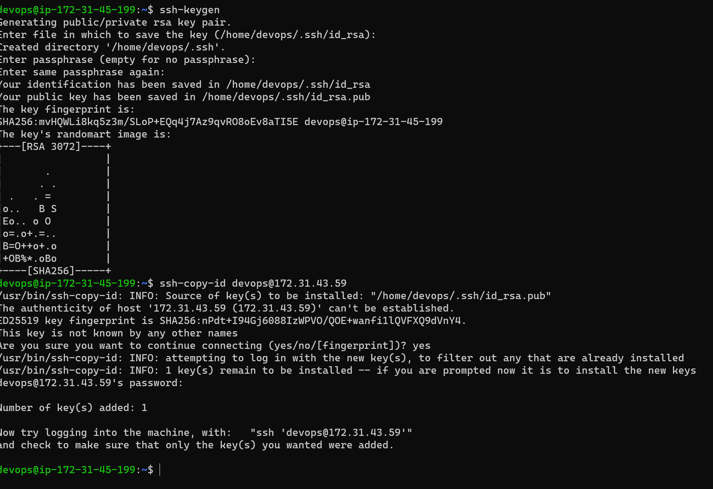
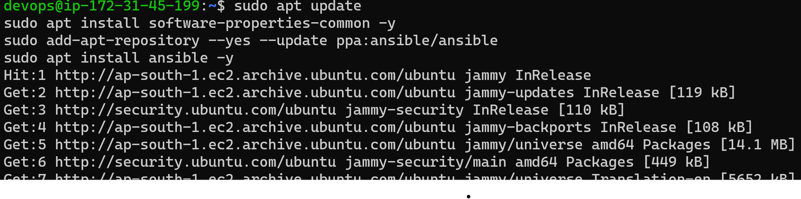
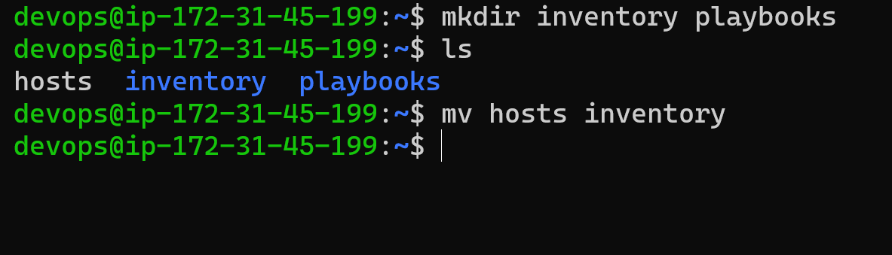
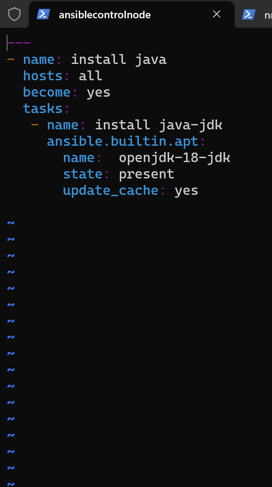

## INSTALL NGINX,DOTNET,JAVA THROUGH ANSIBLE CONTROL NODE
---

###step to perform
 1. Creat two ubuntu vm's
 2. Enable  the passwd authentication
 ```
 sudo vi /etc/ssh/sshd_config
```	

3. Restart the sshd service

4. now create a user "devops"on both the instance

5. Give sudo permissions to the users onthe both the instances

6. Now login to the  devops user on both the instance

7. Now create ssh-keygen on controii node

8. Now copy id of the control node  to the
 node1 by giving the private ip adress of node1

 ###NOW WE HAVE CONNECTED BOTH THE MACHINES
 
 9. To check the create a hosts file with node1 private ip adresses and run the command 
 ```

 ansible -i hosts -m ping 
 ```
  it will give some output which looks like this below 

  ### NOW INSTALL ANSIBLE IN CONTROL NODE IN DEVOPS

  ```
  sudo apt update
sudo apt install software-properties-common -y
sudo add-apt-repository --yes --update ppa:ansible/ansible
sudo apt install ansible -y
```

### INSTALLING JAVA USING ANSIBLE 

1. Create two directories named as inventory playbooks 
2. in inventory create hosts file and give node1 private ip adress

3. in the playbooks directory write a play installing java
 
4. Now run the command 
```

ansible-playbook -i <inventory_path> <playbooks_path>
```
### NOW WE WILL SEE OUTPUT LIKE THIS 
### INSTALLING DOTNET AND NGINX
.jpeg)
1. in the playbooks directory write a play installing nginx and dotnet


 
